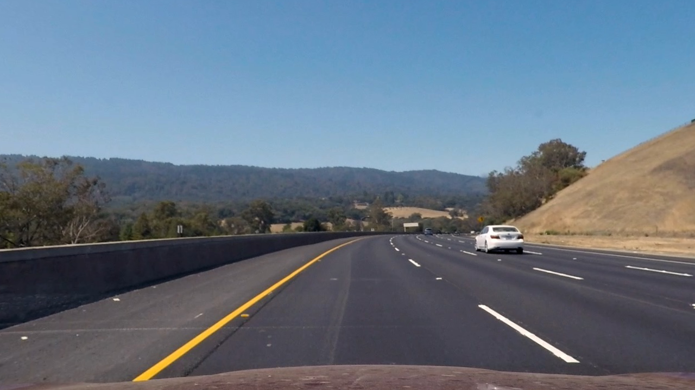

## Finding Lane Boundaries on the Road

The project is a software pipeline that does road lane boundaries identification on images or on video. The project uses two assumptions:
- camera is mounted at the center of a car
- lane lines are parallel
- lane lines could be white or yellow

##

**How to start with your own camera**

[//]: # (Image References)

[img_corners]: ./images/corners.png "Internal corners nx=9, ny=6"
[img_chessboard_distorted]: ./images/chessboard_distorted.png "Barrel distortion example"
[img_chessboard_undistorted]: ./images/chessboard_undistorted.png "Image undistortion example"
[gif_pipeline_visualisation]: ./images/pipeline.gif "Pipeline visualisation"
[gif_road_image_undistortion]: ./images/road_image_undistortion.gif "Road image undistortion"
[img_undistorted_image]: ./images/001_undistorted_image.png "Undistorted road image"
[img_bw_image_filtered]: ./images/002_bw_image_filtered.png "Undistorted road image"

Here is required steps with some description:

1. Prepare set of camera calibration images for image distortion correction

Camera calibration requires images of [chess board pattern](images/pattern.png) taken by the camera from different angles and distances. 

2. Update [camera configuration](https://github.com/wakeful-sun/lane-finder/blob/105d35d85a5edc6c61776560e8a3858a6aa0f6e2/code/main.py#L35) and [camera calibration](https://github.com/wakeful-sun/lane-finder/blob/105d35d85a5edc6c61776560e8a3858a6aa0f6e2/code/main.py#L38) parameters

```
w, h = 1280, 720

camera = Camera(w, h)
camera.load_calibration_images(nx=9, ny=6, path_pattern="path_to_camera_calibration_images")
camera.calibrate()
```

- w, h - camera image width and height
- nx, ny - number of internal corners per a chessboard row (ny) and column (nx). Here is a visualization of nx=9 ny=6 chessboard:

![alt text][img_corners]

- path_pattern - path to prepared calibration chessboard images

3. Define initial [lane vanishing point distance](https://github.com/wakeful-sun/lane-finder/blob/105d35d85a5edc6c61776560e8a3858a6aa0f6e2/code/main.py#L25)

```
initial_vanishing_point_distance = 310
```

Lane vanishing point distance is a distance from bottom of an image to lane perspective center in pixels. 
It don't have to be precise value - program will adjust it during video frames processing.

4. Set [meters per pixel coefficient](https://github.com/wakeful-sun/lane-finder/blob/105d35d85a5edc6c61776560e8a3858a6aa0f6e2/code/main.py#L26) that corresponds to bottom of an image for proper scailing.

```
x_meters_per_pixel = 3.7 / 700
```

##
### Detailed program description 

**Camera Calibration**

Optical distortion is a camera lens error that deforms and bends physically straight lines and makes them appear curvy on image. 
Camera I used also produces distorted images. Camera calibration produces distortion coefficients, that can be applied to any camera image for distortion minimisation. My camera calibration is built on top of [OpenCV](https://docs.opencv.org/3.3.1/dc/dbb/tutorial_py_calibration.html) library and consits of:

- calibration data collection. For given (nx, ny) pattern I retrieve actual coordinates from each real calibration chessboard image using `cv2.findChessboardCorners` function
```
camera.load_calibration_images(nx=9, ny=6, path_pattern="../input/camera_calibration/calibration*.jpg")
```
- actual camera calibration. In order to get distortion coefficients I pass collected calibration data to `cv2.calibrateCamera` function
```
camera.calibrate()
```

Now instance of [`Camera`](https://github.com/wakeful-sun/lane-finder/blob/master/code/camera.py) class contains distortion coefficients which can be applied to any camera image. Distorted camera image and distortion coefficient are passed to `cv2.undistort` function which produces new undistorted image
```
undistorted_image = camera.undistort(bgr_frame)
```
Here is an example of image distortion minimisation:

|![alt text][img_chessboard_distorted] |![alt text][img_chessboard_undistorted]|
|:---:|:---:|
| original image | undistorted image | 

The result is not perfect, but it is a way better than source image. I would assume more calibration images should make the end result even better.

**Image processing pipeline**

Image processing pipeline is defined in [`ImageProcessor`](https://github.com/wakeful-sun/lane-finder/blob/master/code/image_processor.py) class. The class constructor function accepts all parties involved in frame processing.

![alt text][gif_pipeline_visualisation]

The pipeline consists of next stages:
- frame undistortion
- color threshold filtering
- perspective transformation to "bird view"
- lane lines detection
- lane validation
- lane mask creation
- lane mask perspective transformation back from "bird view"
- original frame image and transformed lane mask concatenation
- frame text information output

<h6>Frame undistortion</h6>
```
undistorted_image = self.camera.undistort(bgr_frame)
```
 ![alt text][gif_road_image_undistortion]

<h6>Color threshold filtering</h6>
Using an assumption that lane lines could be lane lines could be white or yellow, I created color filter for highlighting yellow and white objects on images. The filter converts image to HSV format and then applies actual color boundaries filter. The result is black & wight image.

|||
|:---:|:---:|
| undistorted image | result of color threshold filtering |

<h6>Perspective transformation to "bird view"</h6>
Coming soon...