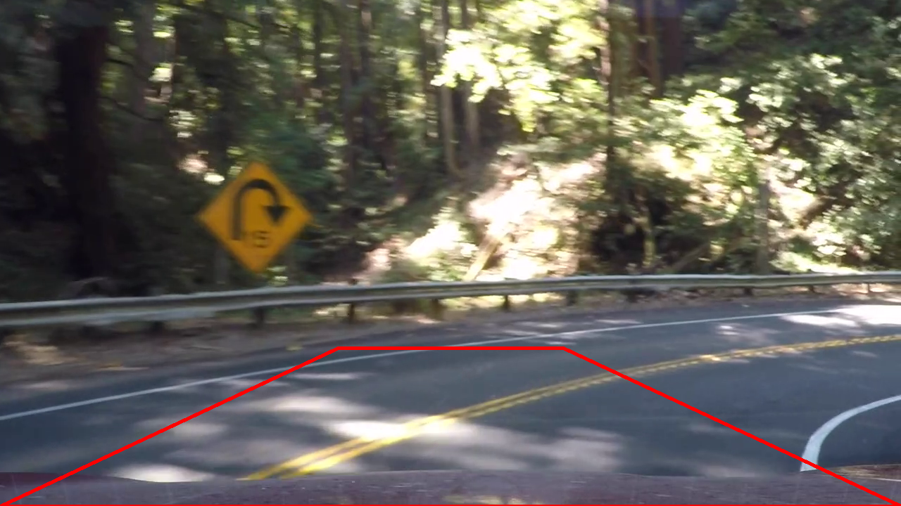

## Finding Lane Boundaries on the Road

The project is a software pipeline that does road lane boundaries identification on images or on video. The project uses some assumptions:
- camera is mounted at the center of a car
- camera optical axis is on car's center line
- lane lines are parallel
- lane lines could be white or yellow

#
#### How to start with your own camera

[//]: # (Image References)

[img_corners]: ./output_images/corners.png "Internal corners nx=9, ny=6"
[img_chessboard_distorted]: ./output_images/chessboard_distorted.png "Barrel distortion example"
[img_chessboard_undistorted]: ./output_images/chessboard_undistorted.png "Image undistortion example"
[gif_pipeline_visualisation]: ./output_images/pipeline.gif "Pipeline visualisation"
[gif_road_image_undistortion]: ./output_images/road_image_undistortion.gif "Road image undistortion"
[img_visual_ray_method]: ./output_images/visual_ray_method.png "Visual ray method visualization"
[img_source_points]: ./output_images/source_points.jpg "Source points"
[img_lane_uml]: ./output_images/lane_uml.png "Lane UML"
[gif_sliding_window_animation]: ./output_images/sliding_window_animation.gif "Sliding window animation"

Here is required steps with some description:

1. Prepare set of camera calibration images for image distortion correction

Camera calibration requires images of [chess board pattern](./output_images/pattern.png) taken by the camera from different angles and distances. 

2. Update [camera configuration](https://github.com/wakeful-sun/lane-finder/blob/105d35d85a5edc6c61776560e8a3858a6aa0f6e2/code/main.py#L35) and [camera calibration](https://github.com/wakeful-sun/lane-finder/blob/105d35d85a5edc6c61776560e8a3858a6aa0f6e2/code/main.py#L38) parameters

``` python
w, h = 1280, 720

camera = Camera(w, h)
camera.load_calibration_images(nx=9, ny=6, path_pattern="path_to_camera_calibration_images")
camera.calibrate()
```

- w, h - camera image width and height
- nx, ny - number of internal corners per a chessboard row (ny) and column (nx). Here is a visualization of nx=9 ny=6 chessboard:

![alt text][img_corners]

- path_pattern - path to prepared calibration chessboard images

3. Define initial [lane vanishing point distance](https://github.com/wakeful-sun/lane-finder/blob/105d35d85a5edc6c61776560e8a3858a6aa0f6e2/code/main.py#L25)

``` python
initial_vanishing_point_distance = 310
```

Lane vanishing point distance is a distance from bottom of an image to straight lane perspective center on flat road in pixels. 
It don't have to be precise value - program will adjust it during video frames processing.

4. Set [meters per pixel coefficient](https://github.com/wakeful-sun/lane-finder/blob/105d35d85a5edc6c61776560e8a3858a6aa0f6e2/code/main.py#L26) that corresponds to bottom of an image for proper scaling.

``` python
x_meters_per_pixel = 3.7 / 700
```

#
#### Detailed program description 

##### Camera Calibration

Optical distortion is a camera lens error that deforms and bends physically straight lines and makes them appear curvy on image. 
Camera I used also produces distorted images. Camera calibration produces distortion coefficients, that can be applied to any camera image for distortion minimisation. My camera calibration is built on top of [OpenCV](https://docs.opencv.org/3.3.1/dc/dbb/tutorial_py_calibration.html) library and consists of:

- collecting calibration data. For given (nx, ny) pattern I retrieve actual coordinates from each real calibration chessboard image using `cv2.findChessboardCorners` function
``` python
camera.load_calibration_images(nx=9, ny=6, path_pattern="../input/camera_calibration/calibration*.jpg")
```
- actual camera calibration. In order to get distortion coefficients I pass collected calibration data to `cv2.calibrateCamera` function
``` python
camera.calibrate()
```

Now instance of [`Camera`](https://github.com/wakeful-sun/lane-finder/blob/master/code/camera.py) class contains distortion coefficients which can be applied to any camera image. Distorted camera image and distortion coefficient are passed to `cv2.undistort` function which produces new undistorted image
``` python
undistorted_image = camera.undistort(bgr_frame)
```
Here is an example of image distortion minimisation:

|![alt text][img_chessboard_distorted] |![alt text][img_chessboard_undistorted]|
|:---:|:---:|
| original image | undistorted image | 

The result is not perfect, but it is a way better than source image. I would assume more calibration images should make the end result even better.

##### Image processing pipeline

Image processing pipeline is defined in [`ImageProcessor`](https://github.com/wakeful-sun/lane-finder/blob/master/code/image_processor.py) class. The class constructor function accepts all parties involved in frame processing.

![alt text][gif_pipeline_visualisation]

The pipeline consists of next stages:
- frame undistortion
- color threshold filtering
- perspective transformation to top-down view
- lane lines detection
- lane validation
- lane mask creation
- lane mask perspective transformation back from top-down view
- undistorted image and transformed lane mask concatenation
- frame text information output

###### Frame undistortion

``` python
undistorted_image = self.camera.undistort(bgr_frame)
```

![alt text][gif_road_image_undistortion]

###### Color threshold filtering

``` python
bw_image_filtered = self.threshold.execute(undistorted_image)
```
Using an assumption that lane lines could be white or yellow, I created color filter for highlighting yellow and white objects on images. The filter converts image to HSV format and then applies actual color boundaries. The result is black & wight image.

|||
|:---:|:---:|
| undistorted image | result of color threshold filtering |

###### Perspective transformation to top-down view

``` python
bw_bird_view = self.perspective_transform.execute(bw_image_filtered, transform_to="top_down_view")
```
In order to be able to get lane physical parameters (like curvature, distances, angle between car central line and road lane central line) we need to apply a perspective transform, so that it looks like we are viewing the road from the top. 

Perspective transformation requires source and destination points. How to choose them? 
I've started from an assumption that lane lines are parallel on real road. 
So correct transformation to top-down view should have parallel lane lines. 
Then using image of **straight lane** below I found lane vanishing point **VP** and simply measured distance to it from the bottom of the image (**A_VP**). 
Initial [vanishing point](https://github.com/wakeful-sun/lane-finder/blob/105d35d85a5edc6c61776560e8a3858a6aa0f6e2/code/main.py#L25) is a configurable parameter that have to be set for certain camera position. 
Another configurable parameter is [**AE** distance](https://github.com/wakeful-sun/lane-finder/blob/20d6176f70656511e2f1241fe01e686b929ff340/code/main.py#L28).

|![alt text][img_source_points]|
|:---:|
|**straight lane on flat road**|

Knowing **A_VP**, **BC** (which is equal **AE**) and **AB** (`image_width/2`) distances and some basic trigonometry we can found [**CD**](https://github.com/wakeful-sun/lane-finder/blob/20d6176f70656511e2f1241fe01e686b929ff340/code/image_operations/transformation_parameters.py#L70) distance. 

```
CD = BC * AB / A_VP
```

And finally it gives us [source points](https://github.com/wakeful-sun/lane-finder/blob/20d6176f70656511e2f1241fe01e686b929ff340/code/image_operations/transformation_parameters.py#L40-L49)

Now I decided not to pick up static destination points for perspective transformation, because it will produce deformed image. Equal scaling along axes will give me opportunity of visual validation of top-down view. 
That also should simplify measurement of lane curvature, distances and car position angles. 

The program uses special algorithm for identifying shape of equally scaled along (x, y) axis top-down view image. The algorithm is built with help of refinement known as [**visual ray method**](https://www.handprint.com/HP/WCL/perspect2.html). 

|![alt text][img_visual_ray_method]|
|:---:|
|**visual ray method applied to straight lane**|

The resulting top-down view image size:
- width is the same with as the one of source image
- height [**DF**](https://github.com/wakeful-sun/lane-finder/blob/20d6176f70656511e2f1241fe01e686b929ff340/code/image_operations/transformation_parameters.py#L76-L78) can be found using known parameters and trigonometric equation:
```
(2 * D_VP + DF) / A'F = (2 * VP - CD) / AC
```
so
```
DF = A'F * (2 * VP - CD) / AC - 2 * D_VP
```

And here is how undistorted image to top-down view image perspective transformation result is look like:

|||
|:---:|:---:|
| undistorted image | result of perspective transformation |

###### Lane lines detection

``` python
self.lane.update(bw_bird_view)
```

Road lane is described in separate [`Lane`](https://github.com/wakeful-sun/lane-finder/blob/master/code/lane/lane.py) class.
It is responsible for lane lines detection and holding the detection result between updates. So its state can used by validation and visualization components later in pipeline.

|![alt text][img_lane_uml]|
|:---:|
|Lane class diagram|           

`Lane` object is initialized one time in [main.py](https://github.com/wakeful-sun/lane-finder/blob/0a07a8f2a9544717371ae0a6102f2d787a150e39/code/main.py#L45-L49) and passed as constructor parameter to `ImageProcessor`

``` python
sliding_window_container = SlidingWindowsContainer()
sliding_window_line_detector = SlidingWindowLineDetector(sliding_window_container)
curved_line_factory = CurvedLineFactory(sliding_window_line_detector)

lane = Lane(curved_line_factory, x_meters_per_pixel)
```
#
*Lane line objects initialization*

In initial state `Lane` object has [empty lane lines](https://github.com/wakeful-sun/lane-finder/blob/0a07a8f2a9544717371ae0a6102f2d787a150e39/code/lane/lane.py#L13-L14).
[On first](https://github.com/wakeful-sun/lane-finder/blob/0a07a8f2a9544717371ae0a6102f2d787a150e39/code/lane/lane.py#L51-L52) `update` method invocation both left and right lane lines [are initialized with](https://github.com/wakeful-sun/lane-finder/blob/0a07a8f2a9544717371ae0a6102f2d787a150e39/code/lane/lane.py#L72-L73) new instances of [`LaneLine`](https://github.com/wakeful-sun/lane-finder/blob/0a07a8f2a9544717371ae0a6102f2d787a150e39/code/lane/lane_line.py) class.
`LaneLine` constructor function requires `start_x` parameter, which is approximate `x` coordinate of lane line at very bottom of the image. This parameter is used exclusively by lane line detection algorithm.
So the program [identifies start points](https://github.com/wakeful-sun/lane-finder/blob/0a07a8f2a9544717371ae0a6102f2d787a150e39/code/lane/lane.py#L76-L86) for each line first.
#
*Lane line detection*

When initialization is done the program [invokes `update` function](https://github.com/wakeful-sun/lane-finder/blob/0a07a8f2a9544717371ae0a6102f2d787a150e39/code/lane/lane.py#L54-L55) on each lane line instance.
``` python
self.left_line.update(bw_image)
self.right_line.update(bw_image)
```
And `LaneLine` forwards this call to the party that does actual lane line detection - to [`CurvedLineFactory`](https://github.com/wakeful-sun/lane-finder/blob/master/code/line_factory/sliding_window/curved_line_factory.py). 
Detection result is written to [`CurvedLine`](https://github.com/wakeful-sun/lane-finder/blob/master/code/line_factory/curved_line.py) instance.
```python
self.line = self.curved_line_factory.create(bw_image, self.start_x)
```
`CurvedLineFactory` uses sliding window method for lane line detection. 
Sliding window detection algorithm itself is implemented in [`SlidingWindowLineDetector`](https://github.com/wakeful-sun/lane-finder/blob/master/code/line_factory/sliding_window/sliding_window_line_detector.py) class and consists of next steps:

  - coordinates of all white pixels are captured in [`Frame`](https://github.com/wakeful-sun/lane-finder/blob/c0236a3247deaa16b468e806918c7ddcf358e883/code/line_factory/sliding_window/sliding_window_line_detector.py#L11) class instance
  - [windows creation](https://github.com/wakeful-sun/lane-finder/blob/c0236a3247deaa16b468e806918c7ddcf358e883/code/line_factory/sliding_window/sliding_window_line_detector.py#L15)
  - [`DetectionArea` class instance creation](https://github.com/wakeful-sun/lane-finder/blob/c0236a3247deaa16b468e806918c7ddcf358e883/code/line_factory/sliding_window/sliding_window_line_detector.py#L20) for each window. [`DetectionArea`](https://github.com/wakeful-sun/lane-finder/blob/master/code/line_factory/sliding_window/detection_area.py) class holds white pixel coordinates that were inside sliding window boundaries. It also has some basic validation logic, to verify if captured pixels are likely to represent lane line
  - next window [center shift](https://github.com/wakeful-sun/lane-finder/blob/c0236a3247deaa16b468e806918c7ddcf358e883/code/line_factory/sliding_window/sliding_window_line_detector.py#L21) if `DetectionArea` is valid

When detection is finished, white points of valid areas from detection results are passed to lane [line coordinates factory](https://github.com/wakeful-sun/lane-finder/blob/c0236a3247deaa16b468e806918c7ddcf358e883/code/line_factory/sliding_window/curved_line_factory.py#L20). [`CurvedLineCoordinatesFactory`](https://github.com/wakeful-sun/lane-finder/blob/master/code/line_factory/curved_line_coordinates_factory.py) fits polynomial of degree 2 (quadratic function) to given white point coordinates with help of `numpy.polyfit` function. 
[`Polynomial`](https://github.com/wakeful-sun/lane-finder/blob/master/code/line_factory/polynomial.py) class has functions that can fetch some useful information from quadratic function coefficients.  

![alt text][gif_sliding_window_animation]

Lines coordinates and quadratic function coefficients [are used for producing](https://github.com/wakeful-sun/lane-finder/blob/c0236a3247deaa16b468e806918c7ddcf358e883/code/line_factory/sliding_window/curved_line_factory.py#L22) `CurvedLine` class instance.

###### Lane validation

``` python
validation_result = self.lane_validator.validate(self.lane)
```
Lane validation is described in [`LaneValidator`](https://github.com/wakeful-sun/lane-finder/blob/master/code/lane/lane_validator.py) class and has some global [configuration parametes](https://github.com/wakeful-sun/lane-finder/blob/5b18b4127649d0b0676c1bdab0bf84a7ce04ccbd/code/main.py#L27-L31)
``` python
lane_width_min_max = (650, 1000)
lane_width_deviation_tolerance = 60
allow_line_projection = True
```
- `lane_width_min_max` is valid lane width boundaries in pixels
- `lane_width_deviation_tolerance` is a lane width deviation tolerance in pixels
- `allow_line_projection` is a switch that turns on/off building lane mask out of one valid lane line when lane width is known and valid

`LaneValidator` also uses assumption that lane lines are parallel.

###### Validation result processing

If lane considered to be invalid program puts lane into initial state, so lane initialization will be executed for the next video frame. 
It also logs validation error and some images and sets undistorted image as lane detection pipeline result.
``` python
if validation_result.lane_is_lost:
    self.lane.reset()
    self.logger.info(validation_result, bgr_frame, bw_bird_view, texts)

    result_image = undistorted_image
```
For valid lane program continues frame processing.

###### Lane mask creation and output

``` python
lane_mask_bird_view = self.lane_mask_factory.create(self.lane, validation_result)
lane_mask = self.perspective_transform.execute(lane_mask_bird_view, transform_to="front_view")

result_image = cv2.addWeighted(lane_mask, 0.9, undistorted_image, 1, 0)
```
The program creates new color image of top-down view lane mask out of lane lines coordinates with help of [`LaneMaskFactory`](https://github.com/wakeful-sun/lane-finder/blob/master/code/lane/lane_mask_factory.py) and transforms it back to front view. 

Then assigns concatenation of lane mask front view and undistorted image to pipeline result image.

###### Vanishing point distance adjustments

``` python
perspective_distance_adjust_direction = self.lane.top_width - self.lane.width
self.perspective_transform.adjust_vanishing_point_distance(perspective_distance_adjust_direction)
```
Each frame does small lane vanishing point shift to the direction that makes lane lines appear parallel in top-down view.
Each vanishing point distance shift runs [perspective transformation coefficients recalculation](https://github.com/wakeful-sun/lane-finder/blob/c0236a3247deaa16b468e806918c7ddcf358e883/code/image_operations/perspective_transformation.py#L44-L53).

###### Frame info output

``` python
FrameInfo.print(result_image, texts)
```
As very last step program prints some frame information with help of [`FrameInfo`](https://github.com/wakeful-sun/lane-finder/blob/master/code/frame_info.py).

#
#### Conclusions 

*Threshold filtering problems*

Current white and yellow filter is not able to identify lane lines in shadow. For example it will not highlight any points on image below. Tweaking color range might decrease the negative effect a bit.


#
*Lane line detection*

I've tried suggested approach that takes confidently detected lane line, creates detection area mask out of it and applies it to the next frame. 
That skips search window mechanism until lane is lost. But I got rid of it. Current sliding window implementation with only basic validation works better. 
Basic validation allows to skip too noisy windows and windows with small amount of detected points.
It can be an improvement point. Ideally, it should recognise line inside window. 
Once it recognized the line we can take only one coordinate which at the middle of the line.
And it should be extremely fast at the same time, because the program has 9 windows for each line at this moment.

``` python
class DetectionArea:

    def __init__(self, start_x, line_points, window_shape):
        percents_threshold_max = 0.2
        pixels_threshold_min = 50

        self.y, self.x = line_points

        x_count = len(self.x)
        pixels_threshold_max = window_shape[0] * window_shape[1] * percents_threshold_max

        self.area_is_valid = pixels_threshold_min < x_count < pixels_threshold_max
        
    ...
    
    @property
    def is_valid(self):
        return self.area_is_valid
```

The program other weak place related to line detection. 
It does not simply work for lane with small radius.
 - lane vanishing point distance is likely to be invalid
 - useful line information is cut by perspective transformation. We can decrease negative effect of it by picking bigger top-down view image width. So it will include some information from nearby areas.
 - lane initialization will not work
 - if line somehow recognized, line coordinates [factory](https://github.com/wakeful-sun/lane-finder/blob/master/code/line_factory/curved_line_coordinates_factory.py) calculates **x** values for each integer **y** in range from zero to image height. And for **y** closer to zero **x** goes to infinity. Or sliding window approach will include invalid points with **x** equal to image width.

|||
|:---:|:---:|
| front view | top-down view |
